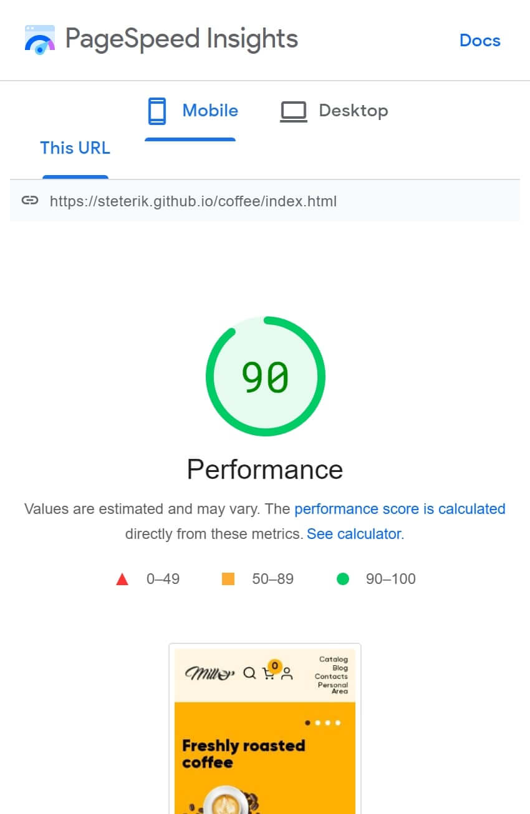

# This is an online store with 13 html pages
[Link to page⬅️][link]
## I used here:
* HTML (BEM, PUG)
* CSS (SASS)
* Pure JavaScript:
	* You can add items to cart
	* Work with items in the cart
	* You can select the weight of the item
	* Items added to cart are stored in LocalStorage
	* 4 modal windows when clicking on this icon 👤
	* Product sorting
	* Swiper-slider
	* Menu-burger
	* Animations
	* Spoilers
	* Tabs
* GULP
* NPM
* GIT

[Link to page⬅️][link]

### Mobile Optimization

[link]: https://steterik.github.io/coffee/